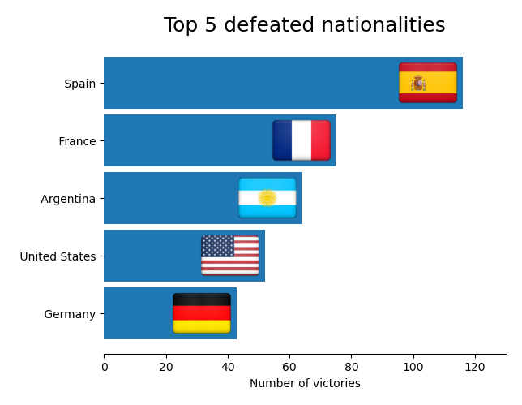

 

# Tennis Stats. Scraping and Data Pipeline.

 

The scope of [this Ironhack project](https://github.com/sgonzalainen/datamad1020-rev/tree/master/projects/W3-pipelines-project) is to prepare a smooth data pipeline.

The objective is to pick a public dataset and enrich it by scraping or via API requests.

## Description
I am a big fan of sports in general, and tennis is one of my favourites, so I chose the dataset *ATP Men's Tour* from __[Kaggle](https://www.kaggle.com/jordangoblet/atp-tour-20002016)__ which collects tennis game results from 2000 until 2016. But it lacks information related to players like nationality, right or left-handed, etc.

Therefore, I decided to enrich the dataset by scraping players info from *https://www.ultimatetennisstatistics.com*. The endproduct are plots which are are used in final report to provide some insights of a chosen player. For this study, Rafael Nadal is the player to be studied about.

Is Rafa really the __[King of Clay](https://www.essentiallysports.com/reasons-nadal-king-clay/)__?

Do lefties perform better on grass as they say __[here](https://www.nytimes.com/2011/06/27/sports/tennis/2011-wimbledon-left-handers-have-benefit-of-slice-and-singularity.html)__?

I invite you to go and visit the __[report](https://github.com/sgonzalainen/IronHack-Project3-Pipeline-Tennis_Stats/blob/main/output/report.ipynb)__ to check that up.

Below an example of a plot created for the study:

## Repo Structure

 `main.py` : file to run.

 `data/` : folder containing clean datasets.

 `src/` : folder containing .py files called from main.py and its auxiliary functions .

  `output/` : folder containing the report as a Jupyter Notebook.

## Further developments

* Create main player name as general variable to pass as argument between .py files .

## Technologies and Environment

Python3 on Ubuntu 20.04

### Scraping
* __[Selenium](https://pypi.org/project/selenium/)__ (setup following [this](https://tecadmin.net/setup-selenium-chromedriver-on-ubuntu/))
* __[BeautifulSoup](https://pypi.org/project/beautifulsoup4/)__ 
* __[tqdm](https://pypi.org/project/tqdm/)__

### Cleaning
* __[Numpy](https://pypi.org/project/numpy/)__ 
* __[Pandas](https://pypi.org/project/pandas/)__ 

### Plotting
* __[Matplotlib](https://pypi.org/project/matplotlib/)__ 
* __[Seaborn](https://pypi.org/project/seaborn/)__ 
* __[iso3166](https://pypi.org/project/iso3166/)__ 

